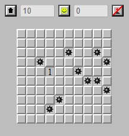

# Minesweeper

## Project Description

This Minesweeper game is a web-based implementation created using HTML, JavaScript, and CSS. It offers a classic Minesweeper experience with customizable difficulty levels, providing players with an engaging and challenging puzzle-solving adventure.

### Features

- Classic Minesweeper gameplay
- Adjustable grid sizes for varying difficulty levels
- Interactive user interface with intuitive controls
- Dynamic grid generation for a unique experience in each game session
- Mobile-friendly

### Technologies Used

1. [JavaScript](https://en.wikipedia.org/wiki/JavaScript)
2. [HTML](https://en.wikipedia.org/wiki/HTML)
3. [CSS](https://en.wikipedia.org/wiki/CSS)

### How to Play:

- Clone the [Repo](https://github.com/CodecoolGlobal/freestyle-javascript-game.git).
- Open the index.html file in your preferred web browser.
- Choose the desired difficulty level or customize the grid size.
- Click on the cells to reveal the hidden squares, but be cautious of the mines!
- Use the provided clues to deduce the mine locations and clear the entire grid to win.

### Media
You cand find the game published [here](https://thenia13.itch.io/minesweeper)

  

